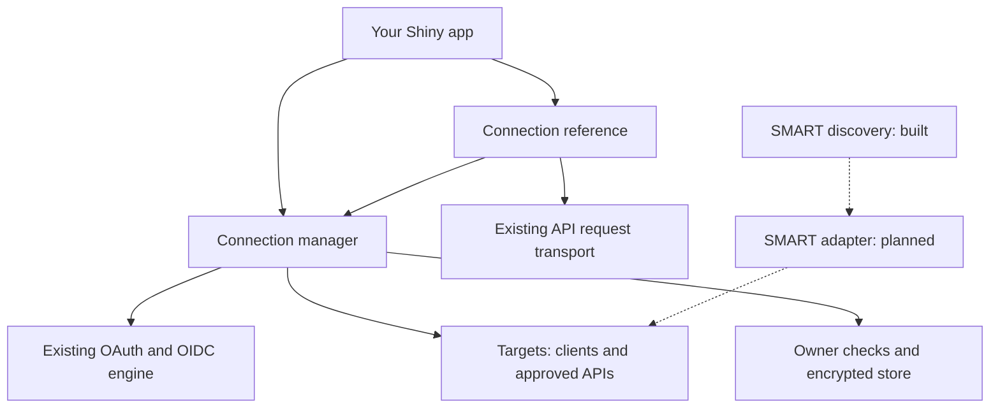

**SMART/FHIR and the new shinyOAuth components, in plain language**

This explains the implementation on `smart_fhir` through P4a (`cfc681a0`), as of
2026-09-10. Examples use invented hospitals and people. The detailed
[roadmap](smart-fhir-roadmap.md) contains the implementation plan; this document
explains the ideas behind it.

**The main change is that one Shiny app can now manage several separate OAuth
authorizations and, when configured to do so, remember them across navigation.**
We are also adding SMART rules so those authorizations can be used consistently
with healthcare systems. The general connection manager is built. SMART
discovery is built. The complete SMART app workflow is still being implemented.

There are two related jobs here: remembering permissions safely, and
understanding the healthcare-specific meaning of those permissions. Much of the
code written so far handles the first job.

**FHIR describes healthcare data. OAuth grants access to data.**

FHIR, pronounced “fire,” stands for Fast Healthcare Interoperability Resources.
It gives healthcare systems shared ways to represent and exchange information.
A `Patient` resource describes a patient; an `Observation` can describe a lab
result; an `Encounter` describes a healthcare visit or interaction. Here,
“resource” means a structured piece of healthcare information. [FHIR overview](https://hl7.org/fhir/R4/overview.html)

For our app, a FHIR server is a healthcare API. Its **FHIR base URL** is the
starting address of that API, such as `https://hospital-a.example/fhir/R4`.
FHIR defines the data and API conventions. Knowing the address does not give
our app permission to read its records.

OAuth is the permission mechanism. In the browser flow we use, the person
authorizes the app through the external service. Our server receives an
**access token**, which it presents when requesting protected data. The person's
hospital password stays with the hospital's login service. Think of the token
as a temporary permission slip for the app. [OAuth introduction](https://www.rfc-editor.org/rfc/rfc6749.html#section-1)

OpenID Connect, usually shortened to **OIDC**, adds a standard way to verify
who signed in. It uses an **ID token** containing identity information that our
code must validate. An access token and an ID token have different purposes.
“May this app read records?” and “Who signed in?” are separate questions.
[OIDC introduction](https://openid.net/specs/openid-connect-core-1_0.html#Introduction)

| Name | What it contributes | Example question |
| --- | --- | --- |
| FHIR | Healthcare data structures and exchange conventions | “What does a Patient record look like?” |
| OAuth 2.0 | Permission for an app to access an API | “May this app read these records?” |
| OIDC | Verified information about the signed-in person | “Which clinician signed in?” |
| SMART App Launch | A specified way to use these mechanisms with healthcare apps | “How does this app request access and receive the relevant patient context?” |

**SMART on FHIR is a healthcare-specific agreement about how to use OAuth.**

SMART App Launch builds on OAuth rather than replacing its authorization flow.
It specifies healthcare app behavior that generic OAuth leaves to individual
services: how the app starts, how it finds authorization settings, how it asks
for FHIR access, and how the server communicates launch context. Our roadmap
targets SMART App Launch 2.2. [SMART overview](https://hl7.org/fhir/smart-app-launch/STU2.2/)

For example, SMART adds the following conventions:

| Convention | Plain-language meaning |
| --- | --- |
| SMART discovery document | “Here are this FHIR server's authorization endpoints and advertised features.” |
| Authorization `aud` parameter | “This authorization request is for this particular FHIR base.” |
| SMART scopes | Permission names with agreed healthcare meanings, rather than arbitrary names chosen by each API. |
| Launch context | Information such as which patient or encounter the app should work with. |
| Required S256 PKCE | A protection tying the authorization request to the later code exchange. Our core already supports it. |

The discovery convention is specified in
[SMART conformance](https://hl7.org/fhir/smart-app-launch/STU2.2/conformance.html);
`aud` and PKCE are specified in the
[authorization flow](https://hl7.org/fhir/smart-app-launch/STU2.2/app-launch.html).

A **scope** is a named permission requested by the app. A SMART scope such as
`patient/Observation.rs` requests read and search access to Observations in the
patient context. SMART gives those parts a meaning: `.r` is read and `.s` is
search. It also defines equivalent ways to express permissions. Our generic
OAuth code currently compares scope strings literally; implementing SMART's
meaning-aware comparisons is the next item, P4b.
[SMART scopes](https://hl7.org/fhir/smart-app-launch/STU2.2/scopes-and-launch-context.html)

There are also two ways an interactive SMART app can start:

- **Standalone:** the person opens our app first, then connects it to a hospital.
- **EHR launch:** the person opens our app from the hospital's electronic health
  record system, perhaps while viewing a patient's chart. The EHR supplies
  launch information so authorization can establish the relevant context.

Both use OAuth. Our remaining P4 work covers standalone support; P5 adds EHR
launch. These names describe how the app starts, not where its R code runs.
[SMART launch modes](https://hl7.org/fhir/smart-app-launch/STU2.2/app-launch.html)

**The problem we set out to solve is easiest to see with two hospitals.**

Imagine a Shiny app where someone clicks “Connect Hospital A,” authorizes access,
then clicks “Connect Hospital B.” The second authorization takes the browser
away from the Shiny app. On returning, the browser can start a new Shiny session.
A Shiny session is the server-side work associated with that browser connection;
it is not the same thing as the person's hospital login.

Our existing OAuth module keeps its token in that Shiny session's reactive
state. The old session's token does not automatically appear in a new session.
Putting two modules on a page therefore does not, by itself, make Hospital A's
authorization survive the trip to Hospital B.

The new manager gives both authorizations a place to live outside an individual
Shiny session, with explicit rules about who can restore them. This problem
also exists when connecting ordinary APIs. SMART motivated the work, but
remembering several authorizations is useful beyond healthcare.

The eventual SMART outcome is to keep both hospital connections and retrieve
each site's selected patient correctly. We have demonstrated the retention part
with real browser navigation and test OAuth services. The complete SMART
patient workflow still needs the remaining adapter and integration work.

**The existing provider, client and token still do their original jobs.**

| Existing component | What it means | Example |
| --- | --- | --- |
| `OAuthProvider` | The external service's OAuth/OIDC settings | Hospital A's authorization and token endpoints. |
| `OAuthClient` | Our app's registration and authorization settings at that service | Its client ID, registered callback address, requested permissions, and any app credentials. |
| `OAuthToken` | Credentials and response information received after authorization | The current access token, any refresh token, expiry, and additional response fields. |
| `oauth_ui()` | Handles the browser-facing callback entry | Receives the return from the authorization service. |
| `oauth_module_server()` | Runs the session's authorization lifecycle | Starts authorization, handles the result, and manages ordinary session tokens. |

A **callback address** is the registered URL where the service sends the browser
back after authorization. The code and browser travel back through that address;
our existing OAuth machinery checks the response and exchanges the code.

We reused that machinery. We did not create a second implementation of OAuth
for hospitals. Existing applications can continue using these interfaces.
Using a hospital URL or a scope containing `patient/` does not automatically
turn on SMART behavior or retained storage.

**A target answers: “Which configured service and API are we connecting to?”**

`oauth_target()` creates an `OAuthTarget`. It groups an existing client with
approved API base addresses and any minimum permissions the application needs.
For example, one target groups Hospital A's app registration with Hospital A's
FHIR base.

The client already knows how our app authorizes. The target adds where a
connection using that client may send its credentials. It is configuration
created at app startup; it contains no person's access token.

This grouping matters because the authorization service and the data API can
have different addresses. Also, two APIs can share a hostname but have different
paths, such as `/hospital-a/fhir` and `/hospital-b/fhir`. Our request checks use
the full approved base, including the path and port.

Targets are read-only configuration. A configuration fingerprint is simply a
way to recognize the settings under which a connection was created. It helps
reject reuse if material settings change; it is not a patient or user identifier.

**A stored connection answers: “Which particular authorization did we receive?”**

Each successful managed authorization creates a separate connection record.
It associates the credentials with their target, their local owner, their
expiry and their current status. A connection ID lets the app select that record.

| Item | Example |
| --- | --- |
| Target `hospital_a` | Shared configuration for connecting our app to Hospital A. |
| Connection `A1` | One person's successful authorization using that target. |
| Connection `A2` | Another authorization using the same target. |
| Target `hospital_b` | Separate configuration for Hospital B. |
| Connection `B1` | An authorization using Hospital B's target. |

These IDs are illustrative; actual connection IDs are opaque generated values.
The ID alone does not grant access. A target can have several connections, and
authorizing again does not silently overwrite an existing one. Here,
“connection” means a managed authorization, not a permanently open network socket.

**A connection reference answers: “How does this Shiny session use that connection?”**

`OAuthConnectionRef` is the object application code uses to make requests.
“Ref” means it looks up the current credentials instead of carrying a token copy
that might become stale. Every request rechecks the current session and
connection, selects the matching client, and enforces the approved API base.

The existing reactive token already updates when it is refreshed. The reference
adds the consistent client/API pairing and access checks around that lookup.
For managed connections, the lookup reads the latest stored record. This also
means disconnecting a record takes effect for an existing reference.

There are two ways to get a reference:

| API | Where its credentials come from | Does this alone retain them across navigation? |
| --- | --- | --- |
| `oauth_connection(target, reactive_token)` | An existing module's reactive token, supplied by the app. | No. The module still owns its lifecycle. |
| The manager server's `connection(id)` | The owner's connection record in the manager's store. | Retention depends on the manager's configured mode. |

The reference itself always belongs to one Shiny session. If that session ends,
the reference becomes unusable. With retention enabled, the new session can get
a new reference to the same stored connection after its owner is checked.

**Targets and references are our library design, not objects required by SMART.**

SMART describes requests, responses and protocol rules. It does not prescribe
how an R package organizes its application objects. We chose these components
to centralize client selection, destination checks and credential lookup.
An app could assemble those pieces manually; these interfaces make the package
responsible for applying the same rules on every connection request.

The separation follows their different lifetimes: target configuration can be
shared across users, a stored authorization belongs to one local owner, and a
reference belongs to one Shiny session. Putting all of that into `OAuthClient`
would mix shared app registration settings with individual authorizations.

The tradeoff is extra configuration and more names to learn. A simple app using
one ordinary OAuth module can keep its existing design. The manager becomes
useful when the app needs several independent authorizations, retention, or
consistent rules for which API each token may reach.

R6 is just the R object system used to implement `OAuthTarget` and
`OAuthConnectionRef`. It lets us expose methods and read-only fields. The
existing provider/client/token objects still use S7. Neither object system is
part of the SMART protocol; applications normally use the factory functions.
Both new R6 classes have generated roxygen2 help documenting their behavior.

**The manager, owner and store make retention work together.**

The **manager** coordinates the list of targets and the current user's
connections. Its public interfaces are:

| Function | Where it belongs | Job |
| --- | --- | --- |
| `oauth_connections()` | Outside `server()`, at app startup | Configure targets, ownership, storage and retention. |
| `oauth_connections_ui()` | Around the app UI | Handle callback entry and browser-owner setup. |
| `oauth_connections_server()` | Inside each Shiny session's `server()` | Provide connect, list, request-reference, refresh/disconnect and logout behavior. |

The app still supplies its own buttons and connection-selection interface.
The server API offers `connect(target_id)`, `connections()`, `connection(id)`,
`disconnect(id)` and `logout()`. It manages the behavior behind those controls.
The current manager requires a distinct registered callback route for each
target, so the return from A is distinguishable from the return from B.

The **owner** answers “Whose saved connections may this request use?” This is
the package's local ownership concept. It is different from OAuth's term
“resource owner,” which concerns permission over data at the external service.

| Retention choice | Local ownership | What survives? |
| --- | --- | --- |
| `"shiny"`, the default | This Shiny session | Existing connections end with that session. |
| `"browser"` | A server-issued browser cookie, checked against a live owner record | Connections can be restored after navigation, while the owner and records remain valid. |
| `"account"` | An existing local app login verified through an app-supplied resolver | Connections can be associated with that local account, within the current process and lifetime limits. |

`oauth_browser_owner()` and `oauth_account_owner()` configure these policies.
The browser cookie is a random lookup credential, not a hospital access token.
Account mode needs the application's trusted login integration; it does not
create an account login system for the app.

The **store**, currently `oauth_connection_store_memory()`, holds encrypted
credential records in the R process. The manager keeps the encryption keys
separate from those stored records. Encryption protects their contents;
ownership checks control who may use them. These solve different problems.

**Currently, retention survives Shiny sessions, not R process restarts.**
This is true of account mode too. Sharing retained connections across several
independent R processes, or restoring them after a restart, requires future
storage/deployment work. Async network workers are supported, but the
authoritative owner checks and store updates remain in one R process.

**The components fit around the existing engine like this.**

Solid arrows show the implemented arrangement. Dotted arrows show planned
SMART adapter configuration; discovery currently returns a standalone metadata
list rather than automatically creating a target.



For the two-hospital example, with browser retention explicitly enabled, the
implemented manager does this:

1. The app already has approved targets for A and B. The manager establishes
   the browser's local owner before authorization begins.
2. The person connects A. The existing OAuth engine handles authorization and
   checks the return. The manager saves the accepted credentials as connection A1.
3. The person connects B. A1 stays in the manager's store while the browser
   navigates away and the old Shiny session ends.
4. The browser returns. The new Shiny session verifies its owner and can find A1.
   B's completed authorization becomes a separate connection B1.
5. The app selects A1 or B1 by connection ID. Its reference uses the matching
   current credentials and approved API address.
6. Disconnecting B1 removes local access through B1. A1 remains available.

The real-browser tests exercise this sequence with synthetic OAuth services.
Replacing them with complete SMART hospital flows is a later P4 checkpoint.

**Why refresh and logout needed extra work.**

A refresh token, when issued, lets the app request a replacement access token.
Some services replace the refresh token too. That means two sessions trying to
refresh the same stored connection at once can interfere with each other.
[OAuth refresh tokens](https://www.rfc-editor.org/rfc/rfc6749.html#section-1.5)

We added coordination so only one refresh owns an update at a time. If a request
may have reached the server but its outcome is unknown, the manager marks the
connection uncertain and requires reconnection. It does not keep trying a
potentially consumed refresh token. A late refresh or login result also cannot
restore a connection that has already been disconnected.

Disconnect removes local access first, then attempts remote token revocation.
If the hospital cannot be reached, the app still considers that connection
disconnected. Manager logout invalidates its local owner session and connections;
it does not claim to log the person out of the hospital or the app's separate
account authentication system.

Remembering a token also does not extend its permission or force a fresh hospital
login. Stored records and owners have expiry limits, and the external API still
decides whether each request is allowed.

**The patient, the signed-in user and the local owner can be different.**

Suppose clinician Sam uses our app to work with patient Alex:

| Value | Meaning |
| --- | --- |
| Local owner | The browser session or local app account allowed to restore saved connections. |
| Validated OIDC identity / `fhirUser` | The signed-in user at the hospital, such as Sam's practitioner identity. |
| SMART `patient` context | The selected patient, such as Alex's patient ID at that hospital. |

SMART's `fhirUser` identifies a FHIR representation of the authenticated user;
patient context identifies the patient relevant to the authorization. Those
can refer to different people. A patient ID is also meaningful in its server's
context: `123` at Hospital A does not establish the same person as `123` at B.
[SMART identity and context](https://hl7.org/fhir/smart-app-launch/STU2.2/scopes-and-launch-context.html)

This is why the design keeps local ownership, external identity, target and
patient context separate. Automatically treating a returned patient ID as the
local user would give it a meaning it does not have.

**We already preserve extra token fields; interpreting them is separate work.**

At the start of this roadmap, `OAuthToken` already exposed
`initial_extra_fields`, the original additional response fields, and
`extra_fields`, the latest response's additional fields. This lets application
code inspect a returned `patient` value. It does not make that value an OIDC
identity claim or automatically associate it with another hospital.

P3's encrypted storage preserves those fields. The remaining SMART context work
will add a separate interpreted view: for example, retaining established patient
context when a refresh omits it, while treating an explicit context change
differently. Reading a raw field today does not mean those future context rules
are already implemented.

**SMART discovery is the first healthcare-specific API we have added.**

`smart_discover()` asks an approved FHIR base for its
`/.well-known/smart-configuration` document. For a base ending in `/fhir/R4`,
that suffix goes after `/fhir/R4`; the path matters. The function validates
metadata and returns a plain R list. OIDC issuer and key information are
conditional on the server's advertised SSO support.
[SMART discovery specification](https://hl7.org/fhir/smart-app-launch/STU2.2/conformance.html)

Discovery is like reading the service's configuration sheet. It does not
register our app, obtain a token, select a patient or prove that every advertised
feature works. Our registration with the hospital still supplies client-specific
settings. The future `smart_target()` adapter will connect the validated
configuration and SMART rules to the existing authorization engine.

The reader checks approved endpoint hosts, refuses redirects and malformed
metadata, and requires the specified PKCE and conditional metadata fields.
It makes no automatic cache that could silently change an in-progress flow.

**RS384 is one signing option, not a separate SMART login system.**

Some app registrations use a private key to prove the app's identity to the
token service. This is called **asymmetric client authentication**: the app
keeps its private key, and the service uses a registered public key to check
the proof. This identifies the app; the person's login is a separate step.
RS384 is a particular digital-signature algorithm used for that
proof. We implemented and independently tested it in the generic signing code.
Existing RSA signing defaults remain unchanged. The future SMART adapter must
still select a compatible key and algorithm using the registration and server
metadata. Signing support alone does not establish a working SMART integration.
The existing [cryptographic tests](../integration/conformance/README.md) describe
the independent verification.

**What is built, and what remains.**

| Work | Current state |
| --- | --- |
| Existing provider/client/token model and OAuth/OIDC engine | Reused; ordinary interfaces keep their behavior. |
| Raw initial/latest extra token fields | Already available at the roadmap's starting point; now also preserved in retained storage. |
| RS384 signing | Built, with independent cryptographic/conformance tests. |
| Internal preparation and callback hooks | Built. They remember who started authorization and which target was chosen, then check that association when the result returns. |
| Internal place for adding scope rules | Built; the current default still compares literal OAuth scopes. |
| Targets and connection references | Built, with roxygen2 class documentation and request/session checks. |
| Encrypted store, owner policies and connection manager | Built for one R process, including refresh/disconnect coordination. |
| Real-browser A-to-B retention | Tested with generic OAuth fixtures, including ordinary query and form POST callbacks and synchronous/async operation. |
| `smart_discover()` | Built; the pinned external sandbox exposes a compatibility failure described below. |
| SMART scope interpretation | P4b engine and token/connection checks built; smart_target() selects them explicitly. See [scope examples](smart-scopes.md). |
| `smart_target()` and SMART registration/request rules | P4c1 built for direct query/form_post authorization; optional transport combinations remain P4c2. |
| Interpreted patient/context handling and Patient/`fhirUser` helpers | P4d1 built; refresh preserves omitted context and marks context changes with a revision. Experimental context remains raw data. |
| Complete standalone SMART app, browser scenarios and two-hospital sandbox repeat | Planned: P4e. |
| Inferno standalone client conformance runs | Planned: P4f. |
| EHR launch entry routes | Planned: P5. |
| Shared callback conveniences, optional extensions and deployment/store adapters | Later roadmap items. |

**The Docker tests have already found a useful compatibility problem.**

The Docker setup runs official SMART Dev Sandbox components with Launcher v2
and synthetic patient data. It is an external simulator for integration testing.
It currently advertises asymmetric client support but omits the signing-algorithm
metadata our strict reader requires. The reader rejects the response. We recorded
the upstream source evidence in the [sandbox notes](../integration/smart/sandbox.md).

That creates two different test results: the diagnostic checks pass because the
reader detects the incomplete response, while the positive compatibility check
fails because the app cannot accept that server's metadata. The latter remains
an open release requirement. We have not patched the server's advertised data
to manufacture a passing result.

The generic browser-retention suite tests the navigation and ownership machinery.
The sandbox tests probe a separate implementation. The planned Inferno tests
will independently examine SMART client requests. They serve different purposes;
none of the current results establishes complete SMART support. Also, this
sandbox allows uncredentialed FHIR reads, so successfully fetching a test Patient
alone would not prove that authorization was enforced.

**For application code, the benefit is fewer pieces to pair manually.**

Here is a small illustration using existing APIs, not a complete runnable app.
`client_a` is assumed to be configured already. This generic target does not
enable SMART-specific scopes or patient interpretation:

```r
# At app startup: keep this client's approved API alongside its configuration.
target_a <- oauth_target(
  client_a,
  resource_bases = c(fhir = "https://hospital-a.example/fhir/R4"),
  label = "Hospital A"
)
```

After configuring a manager and its matching UI wrapper, the session can use
its selected connection like this. This fragment belongs inside `server()`;
`connection_id` must select a connection returned by that owner's manager:

```r
health <- oauth_connections_server("health", manager)

response <- shiny::reactive({
  shiny::req(input$connection_id)
  connection <- health$connection(input$connection_id)
  shiny::req(connection$is_usable())
  connection$request("fhir", "Patient/123")
})
```

Here `fhir` is the app's local name for an approved API base. `Patient/123` is
an illustrative explicit resource path, not automatically selected patient
context. The request uses the chosen connection's matching client, current token
and base URL. The server still enforces actual access; the app must declare any
required operation scopes. The future SMART helpers will supply the additional
healthcare-specific interpretation.

For actual manager setup, including retained owner/store/key configuration and
registered callback routes, see the
[manager API](../R/oauth_connections.R) and
[server API examples](../R/oauth_connections_server.R). For the next implementation
steps and their required evidence, use the [roadmap](smart-fhir-roadmap.md).
