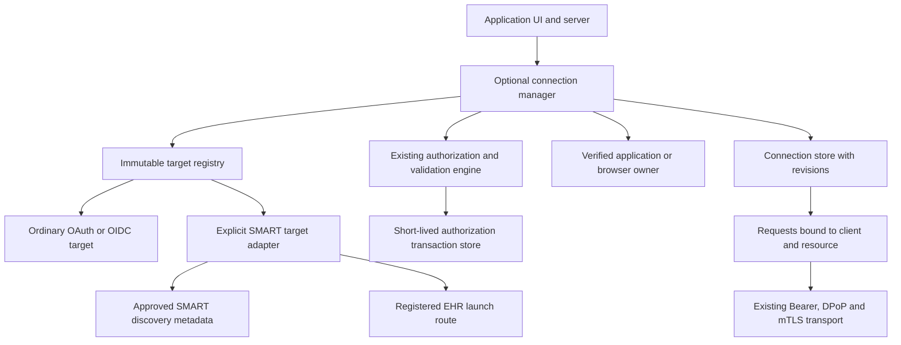
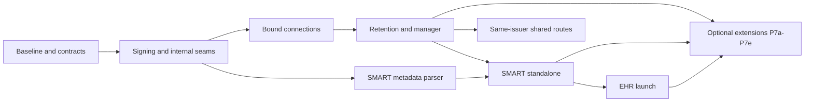

**Proposed implementation: SMART on FHIR and multiple retained OAuth connections**

Start with the [plain-language explanation](smart-fhir-explained.md) for what
SMART/FHIR means, why the new components exist, and which pieces are built today.

Prepared 2026-09-10 against shinyOAuth 0.5.0.9000, commit `04127c9d`. The baseline tables and interface sketches record the original proposal; the implementation update below and current API help describe what is available now. The proposal combines the attached multiple-authorization-server assessment with the SMART review and inspection of callback, state, refresh and resource-request behavior.

The recommended direction is an optional connection-management layer over the existing OAuth/OIDC implementation, with an explicit SMART adapter. Ordinary `oauth_client()`, `oauth_ui()`, `oauth_module_server()`, and token helpers retain their defaults and protocol behavior. Persistent credentials, SMART metadata, SMART launch routing, and SMART scope semantics require selecting the new interfaces.

The first complete user outcome is: connect to healthcare site A, navigate to site B to authorize, return with both connections available, and retrieve each site's selected patient using the correct credentials and FHIR base. Reading `extra_fields$patient` already works; retaining and correctly associating all these connections is the larger feature.

**Implementation update, 2026-09-11.** P0-P2 are implemented, including RS384, the generic target/reference objects, their R6 documentation, and independent Python cryptographic/conformance tests. P3 is implemented for a single R process: encrypted storage (P3a), browser/account owner sessions (P3b), manager UI/server and lifecycle integration (P3c), and the generic browser-retention gate (P3d). That browser matrix passes 104 assertions across query/form_post and sync/mirai using the explicit HTTP loopback exception; it does not establish SMART conformance.

P4a adds `smart_discover()`, a plain metadata snapshot, documentation, metadata/endpoint policy tests and live Launcher v2 discovery diagnostics. P4b's scope evaluator and token/connection integration are implemented. P4c1 adds `smart_target()` for explicit registrations, S256, FHIR `aud`, identity policy and direct query/form_post authorization. P4d1 adds interpreted patient/encounter/banner context, context revisions across refresh, validated `fhirUser` continuity and bound resource helpers. These foundations have separate commits.

**P5a EHR entry is implemented** with `smart_launch_route()`, encrypted owner-bound handoffs, clean continuation, one-use per-flow launch parameters, and a real-browser two-site fixture/CI job. See [setup, tests and supported deployment](../integration/smart/ehr-launch.md). It requires top-level navigation, browser retention and one R process. P5b retains external EHR compatibility and the complete registration matrix as release gates. P4c2 transport composition, broader P4d context policy, P4e-P4f and P6-P7 remain planned. Implementing early EHR entry does not close those P4 gates.

The [official SMART sandbox](../integration/smart/sandbox.md) supplies executable smoke/discovery diagnostics. The [Inferno STU2.2 Client gate](../integration/smart/inferno.md) has not run; its pinned metadata also needs deployment preflight. Local fixture success does not establish external SMART compatibility. The proposal's baseline comparisons and later interface sketches below remain historical/design context.

**P4a external finding.** The pinned Launcher v2 advertises asymmetric clients but omits `token_endpoint_auth_signing_alg_values_supported`; strict discovery rejects it. The current upstream handler has the same omission. P4a's reader and diagnostic tests are implemented, but its positive external acceptance gate remains open. `Rscript integration/smart/run-tests.R --require-compatible-discovery` enforces that gate and currently fails. Do not treat passing diagnostic rejection tests as SMART compatibility. See [sandbox evidence and follow-up](../integration/smart/sandbox.md).

**Feature applicability.**

The labels below distinguish where each feature is useful:

- **General OAuth/OIDC**: useful independently of SMART/FHIR. Implement in the reusable core or optional connection manager; no FHIR dependency is needed. This does not mean every provider supports the feature.
- **SMART/FHIR**: implements healthcare-specific protocol semantics or FHIR resource behavior. Enable only through explicit SMART/FHIR interfaces.
- **Shared + SMART**: combines a reusable OAuth/OIDC mechanism with SMART-specific rules. Keep the mechanism generic and select the SMART rules only through the adapter.

Applicability is separate from activation. A broadly useful feature such as persistent credentials, shared callback routing, or embedding still requires the explicit selection and protections described below. These labels do not authorize changing existing defaults.

This catalogue includes the smaller features within each phase, so a mixed phase does not obscure which parts benefit ordinary OAuth/OIDC applications.

| Feature | Applicability | Broader benefit or SMART-specific boundary | Delivery |
| --- | --- | --- | --- |
| Preserve initial and latest additional token fields | General OAuth/OIDC | Exposes provider extensions without interpreting them as identity claims; SMART `patient` is one consumer. | Already available; P0 documentation |
| Multiple-server setup and compatibility examples | General OAuth/OIDC | Helps apps connect to several identity providers or API services. | P0 |
| SMART protocol fixtures and interoperability examples | SMART/FHIR | Establishes SMART-specific request, response and launch expectations. | P0, P4-P5 |
| RS384 client-assertion signing and key checks | General OAuth/OIDC | Supports registrations requiring RS384 beyond healthcare; existing signing defaults remain unchanged. | P1 |
| Internal scope evaluator interface | General OAuth/OIDC | Separates generic scope reconciliation from an explicitly selected profile's rules. | P1 |
| Structured authorization preparation and immutable per-transaction context | General OAuth/OIDC | Lets a manager bind routing, resource and owner data without URL scraping or global client mutation. | P1 |
| Target registry, connection references and connection-selection UI/server API | General OAuth/OIDC | Keeps each account/grant associated with its client and resource, including several accounts at one provider. | P2-P3 |
| Exact resource-base binding and safe request/reference resolution | General OAuth/OIDC | Prevents credentials crossing API origins or base paths; useful for ordinary multi-tenant APIs too. | P2 |
| Connection retention across redirects and Shiny sessions | General OAuth/OIDC | Connecting service B need not discard service A. | P3 |
| Browser ownership and trusted local-account ownership | General OAuth/OIDC | Controls who can restore or mutate connections, independently of an external provider's identity. | P3 |
| Versioned encrypted storage, expiry and restoration policy | General OAuth/OIDC | Supports retained credentials with explicit lifetimes and deployment-controlled keys. | P3 |
| Atomic refresh, rotation, uncertain-outcome handling and worker coordination | General OAuth/OIDC | Protects rotating refresh tokens and consistency across sessions/workers. | P3 |
| Disconnect, revocation reporting and logout/late-completion handling | General OAuth/OIDC | Makes local access removal reliable even when remote revocation fails or operations overlap. | P3 |
| Sender-constrained credential restoration | General OAuth/OIDC | Preserves DPoP/mTLS key and certificate binding for any supported provider. | P3 |
| Distinct callback routes and issuer-identified shared routes | General OAuth/OIDC | Reuses existing multi-authorization-server defenses in the manager. | P3 |
| SMART discovery and capability/registration configuration | SMART/FHIR | Reads the FHIR base's SMART metadata and builds the healthcare profile; does not replace OIDC discovery. | P4 |
| SMART authorization parameters, S256 requirement and optional `fhirUser` identity | SMART/FHIR | Applies SMART `aud`, launch and identity rules using the existing generic OAuth/OIDC validation engine. | P4 |
| SMART scope equivalence and supported v1/v2 scope interpretation | SMART/FHIR | Supplies the evaluator's SMART implementation; other profiles keep literal scope semantics. | P4 |
| Required versus optional permissions and grant evidence | Shared + SMART | A reusable distinction for managed operations; SMART scope semantics and required response fields belong to the adapter. | P2 contract, P4 SMART rules |
| Effective patient/encounter/context lifecycle across refresh | SMART/FHIR | Interprets launch context while retaining the generic raw token snapshots unchanged. | P4 |
| Patient and user resource helpers; FHIR provenance | SMART/FHIR | Resolves the selected Patient and validated `fhirUser` separately, through the reusable request policy. | P4 |
| Asymmetric authentication capability and key-ID policy | Shared + SMART | Generic signing/key compatibility supports other profiles; SMART selects its required algorithms and registration rules. | P1 signer, P4 policy |
| EHR launch route, approved FHIR-base selection and launch-handle lifecycle | SMART/FHIR | Interprets launch `iss`/`launch` only on registered routes, using generic transaction binding and owner checks. | P5 |
| Same-issuer shared callback routing index | General OAuth/OIDC | Supports multiple registrations or resources behind one issuer while retaining independent callback validation. | P6 |
| JAR/PAR/JARM composition checks | Shared + SMART | Generic transports remain reusable; SMART needs explicit parameter mapping and combination tests, including its `aud` collision with JAR. | P4-P5 supported combinations; JAR deferred until resolved |
| Local connection lifetime versus remote authentication freshness | Shared + SMART | The distinction helps any provider lacking a requested freshness mechanism; SMART needs a policy for servers without `max_age` support. | P3 lifecycle, P4 policy |
| Refresh scope narrowing | General OAuth/OIDC | Allows supported providers to issue a reduced-scope refreshed token; not inherently a FHIR feature. | P7a |
| Authorization POST for long scope requests | General OAuth/OIDC | Helps any provider-supported flow with long requests; SMART's granular scopes are one motivation. | P7b |
| Embedded deployment mode | Shared + SMART | Browser/session/navigation handling is reusable for embedded Shiny OAuth apps; EHR launch and return-to-frame behavior is SMART-specific. | P7c |
| Approved multi-resource `authorization_details` | Shared + SMART | A generic extension container and resource policy can support other profiles; SMART-specific detail types, locations and context require their own adapter. | P7d |
| Account-persistent deployment/store adapters | General OAuth/OIDC | Makes retained account-owned connections practical across workers and restarts; not limited to health records. | P7e; ownership contract in P3 |
| Redacted summaries, errors and lifecycle telemetry | General OAuth/OIDC | Avoids exposing credentials or arbitrary sensitive extension data, including SMART patient/context fields. | P2-P5, all release gates |

Deferred features are classified separately after the roadmap. Reuse of generic cryptography, HTTP or storage does not make SMART launch/context semantics generic; those remain confined to the SMART adapter.

**1. Baseline and implementation boundaries.**

| Area | Applicability | Current evidence | Proposed treatment |
| --- | --- | --- | --- |
| Additional token fields | General OAuth/OIDC | `extra_fields` preserves the latest extras; `initial_extra_fields` retains the login response. | Reuse both properties without changing their meanings. |
| Multiple authorization servers | General OAuth/OIDC | Separate clients/modules and the callback registry exist. | Reuse their validation and expose a simpler manager interface. |
| Connections across redirects | General OAuth/OIDC | Module credentials start at `NULL` in each new Shiny session. | Add explicit connection retention and restoration. |
| Requests to resource servers | General OAuth/OIDC | Client, token, and destination are separate arguments; host restrictions are available. | Add connection-bound requests with exact origin and base-path restrictions. |
| Shared callback, same issuer | General OAuth/OIDC | The registry rejects this configuration. | Use distinct routes initially; add an opt-in manager router later. |
| EHR launch | SMART/FHIR | The UI wrapper classifies launch `iss` as callback data and rejects normal launch requests. | Add a registered SMART launch handler before callback classification, only in the new wrapper. |
| SMART discovery | SMART/FHIR | The existing helper implements OIDC discovery. | Add a separate metadata reader and target factory. |
| SMART scopes | Shared + SMART | Syntax passes through, but equivalent grants are compared as different strings. | Extract a generic evaluation interface; select SMART semantics only for managed SMART flows. |
| Client assertions | General OAuth/OIDC | ES384 signing works; RS384 signing is unsupported. | Add and test RS384 as an explicitly selected algorithm; retain existing defaults. |
| Refresh coordination | General OAuth/OIDC | The existing in-flight registry is process-local. | Add store-level coordination for retained connections used by multiple sessions/workers. |

Relevant implementation anchors: [token fields](../R/classes__OAuthToken.R), [module lifecycle](../R/oauth_module_server.R), [callback registry](../R/utils__callback_registry.R), [HTTP callback classification](../R/oauth_ui.R), [provider fingerprint](../R/classes__OAuthProvider.R), [state validation](../R/utils__state.R), [refresh handling](../R/methods__token.R), [resource requests](../R/methods__client_bearer_req.R), [OIDC discovery](../R/providers__oidc_discovery.R), and [JWT signing](../R/utils__jwt_signing.R).

The protocol baseline is [SMART App Launch STU 2.2](https://hl7.org/fhir/smart-app-launch/STU2.2/). Callback routing continues to require authorization-server identification or distinct registered redirect URIs. A routing lookup, state, PKCE, or an ID token received after exchanging a code does not replace that decision. [OAuth Security BCP, section 4.4.2](https://www.rfc-editor.org/rfc/rfc9700.html#section-4.4.2)

**2. Architecture and ownership.**



Use separate concepts instead of treating issuer, site, registration, and connection as interchangeable:

| Proposed object | Applicability | Responsibility | Lifetime |
| --- | --- | --- | --- |
| `SmartServerMetadata` | SMART/FHIR | FHIR base, discovered endpoints, optional OIDC metadata, capabilities, metadata version and trust policy. | Cached configuration; refreshed outside pending transactions. |
| `OAuthTarget` | General OAuth/OIDC | One configured authorization destination: client registration, requested resource policy, protocol profile, callback policy, and configuration version. | Application configuration. Several targets can use one issuer. |
| `OAuthOwner` | General OAuth/OIDC | A verified local principal or server-issued browser session that may access stored connections. | Explicit owner/session lifetime. |
| Internal authorization transaction | General OAuth/OIDC; optional profile data | Target/version, intended owner, browser binding, scopes, resource, optional profile context, and existing OAuth state. SMART launch data is supplied by the adapter. | Short-lived and single-use. |
| Internal connection record | General OAuth/OIDC; optional profile data | One accepted grant plus originating target/client, token bundle, resource policy, optional profile context, revision, and lifecycle status. | One owner-scoped connection. |
| `OAuthConnectionRef` | General OAuth/OIDC | Server-side reference used for requests and lifecycle operations; resolves the latest record for that owner. | A handle, not a copied credential snapshot. |

The registry key is a local target ID. Each successful connection has a separate opaque connection ID. Neither is a user identity. One target may have multiple connections, for example accounts or different patient launches; these never overwrite each other implicitly. Reconnection of a particular connection must name that connection and verify its owner and expected identity policy.

An OIDC identity is keyed by the validated issuer and subject. Patient provenance includes the FHIR base and patient ID. Equal email addresses, subjects from different issuers, or patient IDs from different FHIR servers do not automatically link people. [OIDC claim stability](https://openid.net/specs/openid-connect-core-1_0.html#ClaimStability)

**3. Explicit opt-in contract.**

| Behavior | Applicability | How the application opts in | Effect on existing interfaces |
| --- | --- | --- | --- |
| SMART discovery, context, scope evaluation and `aud` | SMART/FHIR | Construct a target using `smart_target()`. | No automatic detection by hostname, scope spelling, issuer, or returned `patient` field. |
| Launch requests containing `iss` and `launch` | SMART/FHIR | Register `smart_launch_route()` with `oauth_connections_ui()`. | Existing `oauth_ui()` continues to classify and validate callbacks as it does today. |
| Credentials survive a Shiny session | General OAuth/OIDC | Choose `retention = "browser"` or `"account"` and provide owner/store configuration. | Existing session-end and logout behavior remains unchanged. |
| Exact resource-base enforcement | General OAuth/OIDC | Use a managed connection and its request methods. | Existing generic request helpers remain available with their documented policies. |
| Same-issuer shared callback routing | General OAuth/OIDC | Select the future manager router explicitly. | Existing static registry restrictions remain in force. |
| RS384 assertions | Shared + SMART | Configure generic RS384 explicitly, or select a SMART asymmetric registration that negotiates it under SMART policy. | Existing RSA defaults stay RS256; no expanded default inbound algorithm policy. |
| Refresh scope narrowing | General OAuth/OIDC | Future explicit `scopes` argument on a managed refresh. | Existing refresh calls still omit request scope. |
| Cross-site embedding | Shared + SMART | Explicit deployment mode with documented browser requirements; EHR navigation adds SMART-specific behavior. | No global cookie-policy relaxation. |

Opt-in enables additional functionality; it does not permit disabling required protections within that functionality. The manager must reject an unsupported callback policy, untrusted resource destination, unsafe store contract, or incompatible feature combination. It must not recover by disabling issuer checks, signature validation, PKCE, or certificate/key binding.

Do not introduce global options such as `shinyOAuth.smart_mode`. Profile selection and every profile-related validation setting belong to an immutable target and its authorization transaction. Configuration fingerprints include the profile identifier/version and relevant policies. Existing transactions created by existing interfaces keep their existing format and validation path.

**4. Proposed application-facing interfaces.**

Keep advanced lifecycle details inside the manager while exposing explicit configuration. This example shows the intended final API after the corresponding roadmap phases; it cannot run against today's package.

Interface ownership follows the same split: `oauth_target()`, `oauth_connections()`, its UI/server wrappers, owner factories and store adapters are **General OAuth/OIDC**. `smart_discover()`, `smart_target()`, `smart_launch_route()` and the `smart_*` context/resource helpers are **SMART/FHIR**. Supplying SMART targets to a generic manager does not apply SMART rules to its ordinary OAuth/OIDC targets.

```r
# Proposed API. The URLs and credentials represent separate app registrations.
server_a <- smart_discover(
  fhir_base = "https://api.site-a.example/fhir/R4",
  allowed_endpoint_hosts = c("api.site-a.example", "login.site-a.example")
)
server_b <- smart_discover(
  fhir_base = "https://api.site-b.example/fhir/R4",
  allowed_endpoint_hosts = c("api.site-b.example", "login.site-b.example")
)

targets <- list(
  site_a = smart_target(
    server_a,
    client_id = Sys.getenv("SITE_A_CLIENT_ID"),
    client_secret = Sys.getenv("SITE_A_CLIENT_SECRET"),
    token_auth_style = "header",
    redirect_uri = "https://app.example/oauth/site-a",
    launch = "standalone",
    identity = "fhirUser",
    scopes = c("launch/patient", "patient/Patient.r")
  ),
  site_b = smart_target(
    server_b,
    client_id = Sys.getenv("SITE_B_CLIENT_ID"),
    client_secret = Sys.getenv("SITE_B_CLIENT_SECRET"),
    token_auth_style = "header",
    redirect_uri = "https://app.example/oauth/site-b",
    launch = "standalone",
    identity = "fhirUser",
    scopes = c("launch/patient", "patient/Patient.r")
  )
)

# deployment_keys is supplied by the application from protected key storage.
# Memory storage supports one R process and survives Shiny sessions, not restarts.
manager <- oauth_connections(
  targets = targets,
  app_origin = "https://app.example",
  callback_policy = "distinct_routes",
  retention = "browser",
  store = oauth_connection_store_memory(),
  owner = oauth_browser_owner(
    idle_timeout = 1800,
    absolute_timeout = 28800,
    same_site = "Lax"
  ),
  keys = deployment_keys
)

ui <- oauth_connections_ui(app_ui, id = "health", manager = manager)

server <- function(input, output, session) {
  health <- oauth_connections_server("health", manager)

  observeEvent(input$connect, {
    health$connect(target_id = input$site)
  })

  # input$connection_id comes from health$connections(), a redacted summary.
  patient <- reactive({
    req(input$connection_id)
    connection <- health$connection(input$connection_id)
    req(connection$is_usable())
    smart_patient(connection) |> httr2::resp_body_json()
  })

  observeEvent(input$disconnect, {
    health$disconnect(input$connection_id, revoke = TRUE)
  })
}

shinyApp(ui, server, uiPattern = ".*")
```

`identity = "fhirUser"` explicitly requests `openid` and `fhirUser` and requires validated identity data. `identity = "none"` requests neither and does not turn on OIDC merely because metadata contains an issuer. Other scopes stay application-selected; no automatic wildcard permission or offline-access request. Authentication style must match the actual registration. Discovery cannot create or discover the application's credentials.

The `retention` default on the new manager is `"shiny"`. Persistent modes require a suitable owner and store; their absence is a configuration error. The memory adapter is an explicit single-process implementation. Production with multiple workers supplies shared stores, stable keys, and compatible configuration on every worker.

Retention does not request a refresh token. An application that needs refresh explicitly includes its chosen `online_access` or `offline_access` scope when supported; storage cannot extend the resulting authorization lifetime. Account retention also requires explicit idle/absolute retention and reauthentication policies, not an indefinite default.

An existing OAuth client can enter the same manager without SMART behavior:

```r
# Proposed API. The client's existing scopes and resource parameters are retained.
generic_target <- oauth_target(
  client = existing_oidc_client,
  resource_bases = c(profile_api = "https://api.example/v1")
)
```

For generic targets, `resource_bases` restricts where the application will send a token; it does not assert that an opaque token contains a particular audience or silently add an OAuth `resource` parameter. Applications continue to configure requested resource indicators on their clients. [OAuth resource indicators](https://www.rfc-editor.org/rfc/rfc8707.html)

| Manager/reference method | Applicability | Proposed contract |
| --- | --- | --- |
| `health$connect(target_id)` | General OAuth/OIDC | Start a new transaction for an approved target; does not discard existing connections. |
| `health$connections()` | General OAuth/OIDC | Reactive summaries: connection ID, target label, status, expiry, and available resource labels. Tokens and raw identity/context lists are excluded. |
| `health$connection(connection_id)` | General OAuth/OIDC | Return an owner-checked reference. Unknown or foreign IDs fail without revealing another owner's record. |
| `connection$is_usable()` | General OAuth/OIDC | Check local availability, expiry and operation status. It is not a guarantee the remote server will authorize an operation. |
| `connection$request(resource_id, path, query, method)` | General OAuth/OIDC | Resolve current credentials and the selected approved resource, then use existing transport helpers. |
| `connection$refresh()` | General OAuth/OIDC | Refresh under store coordination and atomically install the accepted result. |
| `health$disconnect(connection_id, revoke = TRUE)` | General OAuth/OIDC | Remove local usability first; attempt configured remote revocation and report its outcome separately. |
| `health$disconnect_all(revoke = TRUE)` | General OAuth/OIDC | Explicitly disconnect this owner's connections; never other owners. |
| `smart_context(connection, source = "effective")` | SMART/FHIR | Return typed, provenance-bearing context. `"initial"` and `"latest"` expose the corresponding historical views. |
| `smart_patient(connection)` | SMART/FHIR | Read the context-selected Patient through that connection's approved FHIR base. |
| `smart_user(connection)` | SMART/FHIR | Resolve a validated `fhirUser` reference subject to the same destination policy. |

Resource helpers return `httr2` responses and remain independent of FHIR resource presentation. Applications decide how to display names and handle absent demographics, access denials, and OperationOutcome responses. The package does not become a general FHIR data-model or record-linkage library.

**5. Persistence and secure restoration.**

Applicability: **General OAuth/OIDC** throughout this section. FHIR data is an optional profile payload; ownership, storage and restoration must work without it.

Three kinds of storage have different responsibilities:

| Store | Contents | Required semantics |
| --- | --- | --- |
| Pending authorization store | Existing sealed OAuth state plus manager transaction binding. | Expiry and atomic single-use consumption; failed routing must not consume another transaction. |
| Owner/session store | Server-issued browser owner sessions or validated local-account session associations. | Expiry, revocation, rotation and owner-session generation checks. |
| Connection store | Accepted credentials, resource/context provenance and lifecycle revision. | Owner-scoped reads, atomic updates, operation claims, deletion/tombstones and expiry. |

Use distinct namespaces and purpose-separated keys. The existing [custom cache contract](../R/custom_cache.R) is useful for pending state and JWKS, but `get/set/take` alone is not a complete connection-store contract. Do not silently repurpose it for retained credentials.

For browser retention, the HTTP wrapper establishes an opaque random owner session using a `Secure`, `HttpOnly`, host-only cookie with a `__Host-` name and root path before Shiny starts. Namespace it by application/manager and bind the server record to the configured application origin. The cookie carries no OAuth credentials or patient information. The explicit `Lax` option in the sketch supports top-level navigation; it changes only this new owner cookie, not the existing transaction-binding cookies. Server-side TTLs remain authoritative because browser closure is not a reliable server notification.

The owner cookie is an application session credential and requires the same care as login credentials. Never expose it through Shiny inputs, URL parameters, localStorage, or logs. Rotate it at owner authentication/account changes; invalidate its generation on local logout. Rotation during concurrent authorization transactions must follow a documented bounded-grace policy, or cancel those transactions. Browser retention does not establish a verified human identity, and anyone using that still-authorized browser session can access its connections until it expires or is cleared.

Connection mutations require an owner-bound Shiny session or a dedicated request with origin validation and CSRF protection; possession of a connection ID or a cross-site GET is insufficient. Owner creation, clearing and restoration have explicit HTTP routes and use the application's trusted public-origin/proxy configuration. Expose no public endpoint that imports arbitrary credentials or attaches them to a caller-selected owner.

Account retention additionally requires an application-provided resolver that validates the local application session on the server. It must not accept an arbitrary user ID from a URL, input control, email address, or callback. A new external healthcare login must never silently change the local connection owner. Browser-owned connections are not automatically migrated into an account after local login; that would require a separate explicit linking operation.

For every authorization start, bind the owner session/generation to the pending transaction. On callback, require both the existing per-transaction browser proof and the still-valid intended owner before exchanging the code or committing credentials. A cross-site POST callback may initially lack the owner cookie: use the existing clean callback continuation, and defer owner-dependent work until the owner can be checked. Do not relax the owner check to accommodate transport.

```mermaid
sequenceDiagram
    participant B as Browser
    participant M as App and connection manager
    participant P as Pending transaction store
    participant C as Owner and connection stores
    participant AS as Site B authorization server
    B->>M: Connect site B in owner session O
    M->>C: Verify owner O; retain existing connection A
    M->>P: Save B transaction with target, owner and browser binding
    M-->>B: Authorization redirect
    B->>AS: Authenticate and authorize
    Note over M: Original Shiny session can end
    AS-->>B: Registered OAuth callback
    B->>M: Callback with OAuth response
    M->>P: Route and validate pending transaction
    M-->>B: Clean callback continuation when needed
    B->>M: Resume with browser and owner proofs
    M->>C: Recheck owner O and session generation
    M->>P: Atomically consume validated OAuth state
    M->>AS: Code exchange with original client and PKCE
    AS-->>M: Token response
    M->>M: Existing token validation plus selected profile checks
    M->>C: Create connection B if owner and transaction remain valid
    M-->>B: New Shiny session lists connections A and B
```

Restoration reads only the current owner's records and rechecks expiry, lifecycle generation, target configuration, and sender-constraint key/certificate references. A persisted `id_token_validated` flag records a prior validation; it does not create a fresh interactive login or reset `auth_time`/local authentication age. Changed issuer, client registration, resource policy, or material validation policy requires reauthorization. Do not quietly reinterpret stored grants under new discovery metadata.

Store an explicit, versioned credential schema rather than serializing live `OAuthClient` objects, functions, caches, or private keys. Include the full token properties needed by existing continuity checks, including `original_id_token`, granted-scope evidence and both extra-field snapshots. External records are authenticated and encrypted using the package's reviewed cryptographic primitives with separate purpose-bound keys. Decode and validate a bounded data schema after authentication. Key references resolve from deployment-controlled key management; credential encryption keys do not reside next to ciphertext in the same backend.

Authenticated encryption does not prevent a backend from replaying an old valid record. Store access controls, monotonic revisions, tombstones, and atomicity remain part of the trust model. Do not describe this as protection against a fully malicious storage service.

**6. Refresh, disconnect, and concurrent workers.**

Applicability: **General OAuth/OIDC**. SMART context processing plugs into the accepted-result commit; refresh coordination and disconnect semantics are shared infrastructure.

The connection store needs these logical operations; exact backend method names can be private until the contract is proven:

```text
read(owner, connection_id) -> record + revision
list(owner) -> redacted summaries
create_if_absent(owner, connection_id, transaction_id, record) -> revision
begin_refresh(owner, connection_id, expected_revision) -> operation_id + revision
commit_refresh(owner, connection_id, operation_id, expected_revision, result)
fail_refresh(owner, connection_id, operation_id, expected_revision, outcome)
disconnect(owner, connection_id, expected_revision) -> tombstone + revocation work
```

Backend operations enforce owner scope and state transition preconditions atomically. `create_if_absent` also prevents one transaction from committing twice. The memory implementation supports these guarantees only inside one process; an external adapter must demonstrate the same semantics across workers before it is advertised as supported.

| Event | Required manager behavior |
| --- | --- |
| Two workers need to refresh one connection | One acquires the operation; the other waits or reloads the committed result. |
| Refresh succeeds and rotates the refresh token | Commit the accepted token bundle and context together under the claimed revision. |
| Transport fails before credentials were sent | Retry only when the existing outcome classification establishes that reuse is safe. |
| Request may have consumed a refresh token, or worker crashes after dispatch | Mark refresh outcome uncertain; do not retry the old refresh token merely because a lease expired. Require reconnection unless a provider-specific recovery mechanism is separately implemented. |
| Disconnect races with refresh/login completion | Tombstone/generation prevents the late operation from restoring credentials. Handle any accepted but unpublished credentials through bounded cleanup. |
| Token exchange succeeds but the connection cannot be committed | Do not announce success. Keep the grant unusable, surface a reconnectable error, and attempt appropriate cleanup. |
| A normal Shiny session ends in browser/account retention mode | Stop that session's observers; keep the explicitly retained connection until its owner/retention policy ends it. |
| Owner logs out or expires | Reject subsequent access and commits immediately; delete/expire owner connections according to retention policy and perform bounded cleanup. |

Reuse the current distinction between `not_consumed`, `possibly_consumed`, and `consumed` refresh outcomes. A distributed lock by itself does not solve uncertain refresh-token rotation. The new manager owns refresh scheduling; it must not run a second legacy module refresh observer against the same stored grant.

Disconnect means local loss of access even when remote revocation is unavailable or fails. Expose `local_status` and `revocation_status` separately, and avoid promising a remote sign-out. Successful token revocation need not terminate the user's EHR login session. [Token revocation responses](https://www.rfc-editor.org/rfc/rfc7009.html#section-2.2)

An explicit `revoke_on_session_end = TRUE` setting is incompatible with browser/account retention on the same managed connection. Reject the conflict with a clear configuration error instead of silently ignoring it. Existing standalone modules retain their current behavior. Persistent account storage does not imply permission for background access; that needs an appropriate grant and application policy.

**7. Callback routing and several resources behind one issuer.**

Applicability: **General OAuth/OIDC**. Several healthcare sites are one use case; multiple registrations, tenants or API resources at an ordinary provider benefit equally.

Use the existing `multi_redirect_uri` defense as the first documented multi-site configuration. The application registers distinct callback routes with the authorization services. A Shiny module ID or query-only target selector is not a substitute for those routes. Existing shared-route support for distinct issuers can be exposed using an explicit `callback_policy = "issuer"` when the server capabilities and response transports support it. Require exact issuer comparison for both success and error callbacks. [RFC 9207 issuer validation](https://www.rfc-editor.org/rfc/rfc9207.html#section-2.4)

The manager may configure the corresponding core mode on its own immutable client copies. It must reject conflicts with an explicitly configured client policy, not silently downgrade it. An issuer being known through OIDC does not establish that the server sends RFC 9207 responses.

A later shared-route extension can distinguish several targets/registrations using the same issuer through the pending transaction:

1. At authorization preparation, record a protected, expiring routing index keyed by a digest of the exact outgoing OAuth state. Its value identifies the approved target, registration/configuration version, and manager transaction.
2. At callback, bound parsing and route validation run before that index lookup. Lookup is read-only and cannot consume state.
3. The index selects a candidate configuration. It does not authenticate a response, authorize an owner, or choose arbitrary endpoints.
4. Independently perform the configured issuer/JARM validation, full existing state/client checks, owner/browser checks, and atomic state consumption before code exchange.

This can avoid changing the wire state format: the manager registers the existing generated state in a separate index. Add a structured internal authorization-preparation result so the manager does not scrape its own authorization URL.

For signed JARM, an unverified state claim may be used only as a bounded routing hint, followed by full verification using the selected approved client. If encrypted JARM cannot be routed without guessing among configurations, require distinct callback routes. Do not introduce trial decryption across an unbounded registry or an unvalidated outer selector as a workaround.

The index identifies a target, which in turn binds the resource base. Changing the visible site selection while a callback is in flight cannot change that callback's destination, client, owner, or patient context.

**8. SMART adapter and resource/context behavior.**

Applicability: **SMART/FHIR** for discovery, launch, SMART scope interpretation and context/resource helpers. The internal scope-evaluator interface, raw token snapshots and exact resource-request restrictions are **General OAuth/OIDC** building blocks reused here.

SMART discovery appends `/.well-known/smart-configuration` to the full FHIR base, including its path. Metadata contains capabilities and only conditionally contains OIDC issuer/JWKS fields. Keep that parsing separate from OIDC metadata requirements. [SMART discovery and capabilities](https://hl7.org/fhir/smart-app-launch/STU2.2/conformance.html)

`smart_discover()` accepts a trusted configured FHIR base and explicit endpoint-host policy. Requests retain existing TLS, response-size and JSON parsing protections and refuse redirects even under the generic redirect option. Metadata requests carry no access token. P4a deliberately has no automatic cache: each call returns a new plain metadata snapshot. Any future cache must key entries by the complete FHIR base and trust policy, not just a hostname or issuer. Missing required profile metadata produces a targeted configuration error. Advertised scopes are informative rather than an exhaustive permission allowlist. Registration and endpoint changes require explicit configuration review; metadata refresh cannot reroute an in-flight authorization or stored grant.

For EHR-supplied bases, first match an exact approved target/base mapping before any discovery or network request. The initial release has no arbitrary-server URL textbox or dynamic client registration. Future user-enrolled servers would require a separately designed enrollment and network trust policy.

The adapter owns request construction for SMART `aud` and the per-launch handle. It requires S256 PKCE, explicitly models identity requirements, and leaves UserInfo optional. It retains the standard state, nonce and ID-token validation implementation. `identity = "fhirUser"` checks that the validated ID token provides a usable `fhirUser`; it does not treat token-response extras as signed claims.

The authorization `aud` is the FHIR base. The OIDC issuer is the authorization server. Client-assertion audience is the token endpoint; ID-token audience is the client registration. Preserve these as separately named fields in the adapter. [SMART authorization flow](https://hl7.org/fhir/smart-app-launch/STU2.2/app-launch.html)

A proposed EHR route configuration is:

```r
# Proposed API. ehr_targets is a registry of smart_target(..., launch = "ehr").
ui <- oauth_connections_ui(
  app_ui,
  id = "health",
  manager = ehr_manager,
  launches = list(
    smart_launch_route(
      path = "/smart/launch",
      targets = c("site_a", "site_b")
    )
  )
)
```

Only that configured route interprets `iss` as a FHIR base. It accepts a well-formed launch request with both launch parameters and rejects mixed launch/callback messages and ambiguous target mappings. It validates lengths and scalar shapes, stores the handle in a short-lived owner/browser-associated launch record, and redirects to a clean application URL before ordinary UI rendering. This initial request is untrusted context and cannot establish authenticated identity. Starting authorization binds the launch record to fresh OAuth state.

Launch handles do not mutate the global provider's `extra_auth_params`. Keep them in the transaction, with the exact target and FHIR base. Once completed, reauthorization must not automatically replay an old EHR launch handle; request a fresh launch or use an explicitly supported standalone flow. Cleanup removes consumed launch records and prevents reusing their continuation handles.

For scopes, factor out the narrow scope-reconciliation decision from `verify_token_set()` into a versioned internal evaluator. Existing callers retain literal OAuth semantics. A SMART target selects an evaluator that can compare interaction unions, v1/v2 mappings, and supported resource wildcards. Keep normalization separate from rewriting wire requests. Unsupported constraints return an explicit indeterminate result; strict semantic checks reject indeterminate comparisons, and the adapter never interprets them as broader permission. SMART defines `.rs` as equivalent to `.r` plus `.s`. [SMART scope equivalence](https://hl7.org/fhir/smart-app-launch/STU2.2/scopes-and-launch-context.html#scope-equivalence)

Preserve the distinction between optional requested permissions and permissions the app requires. A reduced grant can create a limited connection; only operations covered by the current grant may be offered. Initial grant data is not evidence of current permissions. SMART-specific response checks can require an explicit returned scope, while ordinary OAuth's scope-omission behavior remains unchanged. Required identity/context omissions produce clear, profile-specific errors.

The context adapter maintains raw snapshots and a separate interpreted context:

| Surface/event | Proposed behavior |
| --- | --- |
| `token@initial_extra_fields` | Unmodified initial response snapshot. |
| `token@extra_fields` | Unmodified latest successful response extras. |
| Refresh omits a launch context field | Preserve the established launch context in the interpreted view, tagged with its source. |
| Refresh explicitly clears a required field | Mark the context unavailable; do not treat null as omission. |
| Refresh changes patient or encounter | Under default `launch_fixed` policy, stop context-dependent requests and require a new launch. Never silently select another patient. |
| Refresh changes optional UI hints | Use the latest explicit value, without changing identity or access permissions. |
| `fhirContext` or another structured field is present | Validate its supported shape and replace that field as a unit; no recursive union of contexts. |
| New authorization | Establish a new launch snapshot and connection, or perform an explicit guarded replacement. |

On a context change after a valid refresh, retain the accepted rotated credentials atomically with a `context_changed` status; do not revert to the previous token. If the response fails token validation, no usable connection is published. Initial and latest views remain available for server-side diagnostics with normal redaction.

In the first release, `authorization_details` and experimental extension fields remain exposed as data. They do not automatically expand credential destinations. Explicit multi-resource support later intersects the latest accepted locations with application-approved bases and resolves context per location; it never assigns one site's patient ID to another site.

All connection-bound requests enforce exact scheme, host, effective port and normalized base-path boundaries. Hostname matching alone is insufficient when two FHIR services share a host. A request selects a resource ID from the connection, then supplies a relative path/query; absolute references and pagination links must be resolved and validated under the same policy before credentials are attached. Do not follow redirects automatically. Global permissive URL options or raw-helper `check_url = FALSE` cannot bypass managed connection policy.

`smart_user()` supports approved absolute or relative references and keeps clinician identity distinct from selected patient context. Cross-base references require an explicitly authorized resource binding or another connection. Do not automatically fetch `smart_style_url`, canonical references, or other extension URLs with the FHIR token.

**9. Feature combinations and generic protocol compatibility.**

**Signing — Shared + SMART.** RS384 work should add a verified outbound signing implementation and matching key compatibility checks, not just amend an allowed-algorithm list. That implementation is general OAuth/OIDC functionality. Preserve every existing default. A SMART asymmetric target requires a registered key identifier and negotiates a supported algorithm from the registration, key and server metadata. This policy is SMART-specific; it must not silently substitute RS256 when RS384/ES384 is required. [SMART asymmetric client authentication](https://hl7.org/fhir/smart-app-launch/STU2.2/client-confidential-asymmetric.html)

**JAR composition — Shared + SMART.** There is an additional composition issue to address explicitly: the current [Request Object builder](../R/utils__jwt_signing.R) removes an ordinary `aud` parameter and replaces it with the JWT's authorization-server audience. SMART uses an authorization parameter of that name for the FHIR base. This is a code-inspection finding, not a newly executed interoperability test. The initial SMART adapter should reject JAR `request`/`request_uri` modes until a standards-grounded mapping has been designed and tested. Do not repurpose the JAR audience or assume `resource` is universally accepted. Ordinary JAR behavior is unchanged. [JAR Request Object requirements](https://www.rfc-editor.org/rfc/rfc9101.html#section-4)

**PAR/JARM composition — Shared + SMART.** These are generic OAuth mechanisms. PAR without JAR may carry ordinary SMART parameters, but support requires targeted transport tests and explicit server capability. JARM response validation is a separate feature from JAR requests; retain its existing rules. A provider requiring an unsupported combination receives a configuration error, not an automatic fallback to a weaker transport.

**Lifetime and authentication freshness — Shared + SMART.** Separating local expiry from remote authentication guarantees is useful for generic providers too. For SMART servers without support for `max_age`, a local connection age limit can expire access and require a new authorization, but must not claim to force fresh remote authentication. Add a SMART target policy distinguishing local lifetime from server-enforced reauthentication. Reject requests for a freshness guarantee the server cannot provide instead of silently weakening the promise. [SMART OIDC requirements](https://hl7.org/fhir/smart-app-launch/STU2.2/scopes-and-launch-context.html#scopes-for-requesting-identity-data)

**Embedded deployment — Shared + SMART.** The initial documented deployment is top-level server-hosted Shiny. Generic embedded applications share the browser/session constraints; EHR launch navigation supplies the SMART-specific part. Embedded EHR launches need browser tests for third-party cookie restrictions, storage partitioning, authorization navigation and return to the right frame. `SameSite=None` alone is not a complete iframe solution. Add an explicit embedded mode only after its flow is verified; do not silently remove browser binding when cookies are unavailable. Native mobile redirect schemes and device OS integrations are general OAuth/OIDC deployment concerns outside this server-hosted Shiny release.

**DPoP/mTLS retention — General OAuth/OIDC.** Retained connections preserve DPoP/mTLS binding information and deployment key references. Never restore a sender-constrained token as ordinary Bearer, or substitute a new key/certificate without a supported renewal flow. The generic manager must either support a configured core feature end to end or reject that combination. Metadata capabilities do not authorize sending a token to a new server.

**10. Implementation roadmap and release gates.**

Use independently reviewable changes with these dependencies. The phases describe deliverables rather than calendar estimates; persistence and callback routing deserve the largest review effort.

| Phase | Applicability | Concrete implementation | Likely files | Exit criterion |
| --- | --- | --- | --- | --- |
| P0: Baseline and contracts | Shared + SMART: generic multi-server baseline plus SMART fixtures | Document current multiple-module pattern and redirect limitation; commit synthetic fixtures and compatibility expectations; add pinned SMART Dev Sandbox R4/launcher/picker infrastructure and smoke CI. | `vignettes/usage.Rmd`, `tests/testthat/test-smart-contracts.R`, `integration/smart/`, `.github/workflows/smart-sandbox.yml` | Existing behavior characterized; external sandbox starts and serves local metadata/data with recorded image pins and capabilities. No claimed application interoperability or persistence from smoke/same-session tests. |
| P1: Additive signing and profile seam | General OAuth/OIDC | Implement RS384 signing; extract scope evaluation and structured authorization preparation without changing defaults. Add internal managed-transaction context hooks. | `R/utils__jwt_signing.R`, `R/classes__OAuthClient.R`, `R/methods__login.R`, `R/utils__state.R` | Existing OAuth/OIDC wire semantics and validations pass unchanged; independent verification of RS384 signatures. |
| P2: Bound target/connection objects | General OAuth/OIDC | Introduce target/resource policy and connection reference; support per-session managed requests using existing transport. | New `R/classes__OAuthTarget.R`, `R/classes__OAuthConnectionRef.R`, `R/methods__connection.R`, `R/utils__resource_binding.R` | Selecting a connection always selects its matching client, token and full resource base. |
| P3: Retained multi-site connections | General OAuth/OIDC | Implement owner sessions, versioned connection store, atomic lifecycle operations, UI/server manager and restoration. Use existing callback defenses; distinct routes are the documented baseline. | New `R/connection_store.R`, `R/utils__connection_owner.R`, `R/oauth_connections.R`, `R/oauth_connections_ui.R`, `R/oauth_connections_server.R`; narrow hooks in current lifecycle code | Real browser A-to-B navigation retains both; owner isolation, uncertain refresh outcomes and disconnect races verified. Single-process scope explicit; shared-worker claims require an external adapter and tests. |
| P4: SMART standalone | SMART/FHIR adapter over P1-P3 | Add discovery, SMART target factory, semantic scope evaluation, typed context and Patient/user helpers, including SMART-specific signing/freshness policies and transport-combination checks. Add real-app Inferno client runs. | New `R/smart_discovery.R`, `R/smart_target.R`, `R/smart_context.R`, `R/smart_scopes.R`, `R/methods__smart_resource.R`; `vignettes/smart-fhir.Rmd`; Inferno fixture/driver in `integration/smart/` | Standalone patient and clinician apps work, including clinician identity distinct from patient and refresh without repeated context. Sandbox browser runs and the Inferno public/symmetric/RS384 asymmetric client matrix pass. Multi-site standalone release candidate. |
| P5: SMART EHR launch | SMART/FHIR; reuses generic transaction infrastructure | Add explicit launch routes, approved-target resolution, sealed launch transaction, clean continuation, per-flow parameters and fresh-launch reauthorization behavior. Extend Inferno client runs to EHR launch. | New `R/smart_launch.R`; targeted changes to the new manager wrapper/router; Inferno driver in `integration/smart/` | Normal `iss`/`launch` entry succeeds; ordinary and mixed callbacks retain existing validation; concurrent launches remain separate. Each supported client profile passes a distinct Inferno EHR scenario with browser evidence. Top-level EHR release candidate. |
| P6: Shared-issuer convenience | General OAuth/OIDC | Add manager routing index for same-issuer targets/registrations and shared routes where unambiguous. | New `R/utils__connection_router.R`; opt-in adapter around `R/utils__callback_registry.R` | Same-issuer distinct resources work without weakening issuer, state, owner or browser checks. Ambiguous encrypted responses still require distinct routes. |
| P7a: Refresh scope narrowing | General OAuth/OIDC | Add explicit requested scopes to managed refresh with grant-continuity checks. | Managed refresh methods and scope evaluator | Supported narrowing works without widening the grant or changing existing refresh calls. |
| P7b: Long authorization requests | General OAuth/OIDC | Add explicitly selected authorization POST where supported by the provider. | Authorization preparation/transport and examples | Long requests preserve transaction binding and provider-specific transport requirements. |
| P7c: Embedded mode | Shared + SMART: generic browser flow plus EHR navigation | Implement verified iframe navigation, session handling and EHR return behavior. | Manager wrapper, SMART launch adapter and browser integration suite | Supported browsers complete the flow without weakening owner/browser binding; unsupported modes fail clearly. |
| P7d: Multi-resource authorization details | Shared + SMART: generic resource contract plus SMART interpretation | Bind accepted, application-approved resource locations; interpret SMART detail types and context in the adapter. | Resource binding, profile detail parser and SMART context adapter | Each request uses its own approved location/context; returned details never automatically expand trust. |
| P7e: Account-persistent deployment adapters | General OAuth/OIDC | Supply production store/owner integration examples and adapters against P3's contract. | Store adapters, deployment examples and integration tests | Multi-worker/restart, expiry and ownership behavior has integration evidence for each supported backend. |

P7a-P7e are separately selectable extensions, not one combined feature switch. The generic portions can also ship for ordinary OAuth/OIDC targets; each still needs its own supported-provider and deployment evidence.

**SMART sandbox integration checkpoints.** Use [integration/smart/sandbox.md](../integration/smart/sandbox.md) as the executable environment and evidence contract. Its current runner owns an isolated Docker project, tests discovery/FHIR/picker readiness with zero skips, records exact image identities and public metadata, and cleans up its own containers and volume. The following application suites are additions required within their phases, not placeholders that may skip indefinitely:

P3 is split into reviewable implementation items: **P3a** encrypted credential schema and atomic memory store; **P3b** owner sessions and generation/expiry enforcement; **P3c** manager UI/server, callback commit, restoration and lifecycle integration; **P3d** real-browser two-site retention evidence. P3a-P3d are implemented for the process-local baseline. The P3d browser matrix passes 104 assertions across query/form_post and sync/mirai, including new Shiny sessions, independent refresh, owner isolation and logout. P3c has separate commits for managed-module hooks and the public manager API. The [retention checkpoint notes](../integration/smart/retention.md) describe the store, owner and manager contracts, passed browser gate and deployment limits. P3 evidence comes from actual browser navigation in `integration/connections/`, in addition to owner/lifecycle tests. SMART-specific sandbox and Inferno gates remain P4/P5.

P4 is split into separate commit-sized items, preserving the phase's original release gates:

| Item | Work | Status |
| --- | --- | --- |
| P4a | Discovery API, strict SMART metadata/endpoint policy, roxygen2 help, live sandbox discovery and HTTP fixtures | Reader implemented; positive external acceptance gate open due to missing launcher algorithm metadata. Registration selection remains P4c |
| P4b | SMART semantic scope evaluator, required/optional grants and explicit returned-scope evidence | Implemented; [scope policy and limits](smart-scopes.md). Selected by smart_target() (P4c1). |
| P4c1 / P4c2 | smart_target(), registration/capability, S256/aud, identity and transport policy | P4c1 implemented for direct query/form_post, public, symmetric Basic and RS384/ES384 registrations. P4c2 PAR/JARM composition and remote freshness policy remain planned; JAR is rejected. |
| P4d1 / P4d2 | Interpreted context, refresh continuity, Patient and validated fhirUser helpers | P4d1 implemented for patient/encounter/banner and identity references, with context revision and encrypted retention. P4d2 richer/experimental context requirements remain planned. |
| P4e | Runnable app/vignette, standalone sandbox browser scenarios, two-site SMART retention repeat | Planned |
| P4f | Pinned Inferno deployment and real-app standalone public/symmetric/RS384 matrix, CI and sanitized conformance evidence | Planned |

P4a does not establish application authorization, identity, resource permissions or standalone conformance. P4b-P4f must pass before the P4 release gate is complete. Keep one commit per item; further splits may be documented when an item needs independently reviewable changes.

P5 is split into an implementation checkpoint and the remaining release evidence:

| Item | Scope | Status |
| --- | --- | --- |
| P5a | Registered EHR entry, exact approved FHIR-base selection, encrypted owner/target handoff, clean continuation, per-transaction launch parameters and fresh-launch reconnect | Implemented with roxygen help and unit/browser tests. `integration/smart/run-ehr-browser.R` tests public registrations across query/form_post and sync/mirai using two strict local fixtures; CI runs the same matrix. |
| P5b | External EHR scenarios and complete supported registration matrix | Planned. Drive the real app through the official sandbox and pinned Inferno client suite; public, symmetric and RS384 rows each require browser and request-verification evidence. Resolve metadata compatibility first. Account/session-only EHR entry and optional transports need separate implementation/tests before support is claimed. |

The P5a public browser matrix passed 88 assertions across query/form_post and
sync/mirai on 2026-09-11; the generic retention repeat passed 104. The fixture
starts two launches before either approval, retains both grants,
checks corresponding Patient reads and refresh/context continuity, and verifies
owner isolation, fresh-launch reconnect and logout. It is maintained with our
implementation and therefore cannot satisfy P5b's independent conformance gate.

P4a validation: 816 regression assertions passed (260 discovery), no failures/skips;
46 Docker diagnostic assertions passed. The explicit positive discovery gate
failed on the pinned launcher's missing algorithm metadata. Package check:
zero errors, warnings and notes. See [validation details](../integration/smart/README.md).

| Phase | Sandbox work within the phase | Release gate |
| --- | --- | --- |
| P3 | Add two isolated launcher/R4 sites with separate data volumes and a real-browser generic manager fixture (`test-browser-retention.R`). | Actual A-to-B navigation and new Shiny sessions retain both owner-bound grants; independent refresh/disconnect and existing store/concurrency tests pass. Repeat the same browser scenario with SMART targets during P4. |
| P4a reader implemented; positive external gate open | `test-smart-discovery.R` against live SMART Launcher v2 metadata and synthetic HTTP fixtures. | Full-base discovery, conditional metadata and endpoint policy checks work. The pinned launcher supplies grant types and S256 but lacks the asymmetric algorithm advertisement, so the reader rejects it. Require an upstream correction or independently verified compatible deployment, then a passing `--require-compatible-discovery` run. P4c1 registration checks are implemented separately. |
| P4 standalone | Add a runnable Shiny SMART app plus `test-browser-standalone.R`; test patient selection, S256, FHIR `aud`, resource provenance and refresh/context behavior. | Actual browser authorization and matching Patient reads pass using the supported profile. Clinician/fhirUser identity requires independently observed SSO capability; absent scope/asymmetric/transport support is not inferred. |
| P5b external repeat | Drive the P5a EHR app and `test-browser-ehr-launch.R` scenarios from the sandbox launcher after compatibility is resolved. | `iss`/`launch` entry, clean continuation, patient/encounter context, simultaneous launches and mixed callback handling pass against the external deployment. P5a's local fixture result is separate evidence. |
| P6 / P7c | Extend the two-site topology and the supported browser matrix. | Same-issuer resource isolation and embedded navigation/cookie behavior each have their own evidence. Top-level smoke tests do not establish either. |

The initial sandbox uses loopback HTTP and synthetic Synthea records. Its FHIR proxy simulates authorization and accepts uncredentialed reads, so data retrieval alone is connectivity evidence. Keep the independent RS384/strict-AS conformance suite and Keycloak tests alongside it; do not treat simulator success as certification or server-side authorization enforcement. Do not patch metadata, disable validation, or weaken the SMART target to obtain a passing 2.2 flow. Any legacy profile must be explicit and separately tested. At P3-P5, expand the sandbox CI triggers to changed R APIs, install the required browser dependencies and require the implemented application-flow suites. Record transport, registration, capabilities, image IDs, browser versions, and results without credentials or patient context in artifacts.

**Inferno client conformance checkpoints.** Follow [integration/smart/inferno.md](../integration/smart/inferno.md). The reviewed upstream kit is 1.0.3, source `980e54e4ed632b28267d797013399a8588772174`. Use `smart_client_stu2_2` (SMART App Launch STU2.2 Client), where Inferno simulates the server and evaluates our app's requests. The `smart_stu2_2` server suite is a different test target.

| Phase | Implementation within the phase | Required result |
| --- | --- | --- |
| P4 | Pin a local Inferno deployment and dependencies; add a real Shiny app fixture, browser/Inferno driver and separate CI job. Register distinct public, symmetric and asymmetric clients; use RS384 for the asymmetric row. Supply matching synthetic Patient/fhirUser resources and launch context. | Each standalone row completes authorization, a matching Patient read and explicit refresh, then passes applicable authorization-request, token-request and token-use verification tests. Record the selected profile/algorithm, tool version, transport and results. |
| P5 | Register EHR launch URLs and repeat each supported App Launch client profile in a fresh scenario. | Browser evidence proves the actual `iss`/`launch` entry; Inferno's verification results pass. A standalone result cannot satisfy the EHR gate. |
| Later backend-services scope | Add the separate Backend Services Confidential Asymmetric Client option only when that SMART profile is implemented. | Its client-credentials evidence is separate from the App Launch RS384 matrix. |

Inferno's reviewed client suite is draft and has documented gaps in scope syntax/continuity, context fulfillment and resource authorization checks. Its server may issue tokens for requests later rejected by the verification tests, so HTTP success is not a pass criterion. Require all applicable results to pass, with no unfinished interactions or unexpected skips. Preserve our scope/context, ID-token, callback, refresh, binding and browser-retention tests. Publish sanitized per-scenario summaries; do not upload raw Inferno request logs containing tokens or context. P4/P5 must expand CI triggers to the relevant R APIs and integration files and require these implemented scenarios before release claims.



Discovery parsing and RS384 can be developed independently, but do not market a complete multi-site workflow before the browser-navigation and retention gates pass. P4 is the first feature-complete answer to the attached standalone multi-site request. P5 adds EHR launch. P6 is a convenience improvement because distinct registered routes already provide a supported solution.

SMART Backend Services is a later, separate grant-flow project: client credentials, system scopes and service ownership differ from interactive patient authorization. It can reuse discovery/signing/resource binding once implemented, but should not simulate an interactive user or reuse a browser connection owner. [SMART Backend Services](https://hl7.org/fhir/smart-app-launch/STU2.2/backend-services.html)

FHIRcast, record matching, experimental app-state persistence, launch Tasks, styling and user-access brand directories are outside the initial roadmap. A future brand picker may help choose approved targets; it must not turn an advertised URL into an automatically trusted token destination. SMART refresh tokens do not by themselves provide live patient-chart context synchronization.

| Deferred feature | Applicability | Boundary for a future proposal |
| --- | --- | --- |
| Client-credentials grant and service-owned connections | General OAuth/OIDC | Useful for machine-to-machine APIs outside healthcare; requires its own noninteractive lifecycle. |
| SMART Backend Services profile | SMART/FHIR | Adds SMART system scopes, discovery and asymmetric-registration rules on top of generic client credentials. The complete project is therefore Shared + SMART. |
| FHIRcast/chart-context synchronization | SMART/FHIR | Healthcare context/event integration; ordinary OAuth token refresh does not implement it. |
| Patient/record matching | SMART/FHIR | Domain-level record linkage, outside the authentication package's proposed responsibility. |
| SMART experimental app-state persistence | SMART/FHIR | Preserves SMART application state under the extension's semantics; distinct from generic credential retention. |
| Launch Tasks | SMART/FHIR | Implements the healthcare workflow/context extension. |
| SMART styling hints and style resources | SMART/FHIR | Healthcare launch presentation integration; must not imply credential access to arbitrary style URLs. |
| User-access brand directories/picker | SMART/FHIR | Implements SMART brand discovery/selection. Its basic approved-target picker could reuse generic manager UI. |
| Native mobile redirects and OS integration | General OAuth/OIDC | Useful for native clients broadly; separate deployment architecture from server-hosted Shiny. |
| User-enrolled servers and dynamic client registration | General OAuth/OIDC | Broadly useful onboarding, requiring a separate trust/registration design; any SMART capability rules stay in its adapter. |

**11. Acceptance tests and compatibility evidence.**

| Test family | Required evidence |
| --- | --- |
| Existing protocol behavior | Existing constructors/defaults, optional UserInfo, missing OAuth scope behavior, state validation, callback success/errors, JWKS, ID tokens, JAR/JARM/PAR, DPoP/mTLS and async paths continue to pass. No extra SMART parameters or persistent owner cookie on old interfaces. |
| Core refactor equivalence | Compare semantic outgoing requests and accepted/rejected outcomes before/after the internal seams, accounting for expected random state, nonce, PKCE and signature values. |
| Two-site browser navigation | Connect A, leave the Shiny session to authorize B, return with A and B; refresh each independently; disconnect B while A remains usable. Verify real navigation and new Shiny sessions. |
| Owner/session isolation | Separate browsers/accounts cannot read or act on each other's connections; local logout, expiry, cookie rotation and in-flight account changes invalidate restoration/commits correctly. |
| Resource binding | Two FHIR bases on one hostname remain separate; every direct request, user reference and pagination link respects exact origin/base-path policy. |
| Store concurrency and recovery | Two workers contend for one refresh; refresh rotation plus crash; storage outage at commit; disconnect versus late success; expired operations; restart and deployment key rotation. No automatic reuse after an uncertain outcome. |
| Authorization server routing | Distinct issuer shared-route success/error; servers lacking issuer response support use distinct routes; same-issuer targets; mismatched configuration; unrouteable encrypted JARM. No code exchange before all applicable checks. |
| SMART discovery | Base paths retained; OAuth-only and SSO metadata; public, secret and asymmetric registrations; metadata/cache trust boundaries; no registration inferred from discovery. |
| SMART launch and context | Standalone versus EHR entry; clinician and patient differ; missing/cleared/changed context; omitted refresh extras; nested context; several concurrent launches; no replay of consumed launch handles. |
| SMART scopes | Interaction equivalence, optional versus required grants, granular restrictions, v1 policy, unsupported comparisons and missing SMART scope response. Generic literal comparison unchanged. |
| Signing and feature combinations | RS384 and ES384 verified independently; key/algorithm compatibility; required key ID; unsupported JAR composition rejected; supported PAR/JARM paths tested separately. |
| Presentation and telemetry | Summaries, printing, traces and errors exclude credentials, launch handles, raw owner identifiers and raw patient/context data; existing redaction tests remain in force. |

For each implementation PR, run focused tests for that change plus affected existing protocol tests. Run the complete package checks and integration matrix at release gates. Positive protocol fixtures can run locally; browser navigation and concurrency need integration tests. A self-built fake server is not independent conformance evidence: add interoperability runs against a SMART reference sandbox and available external conformance tooling before broad support claims, recording versions and capability sets.

Testing retained `online_access` versus `offline_access` must distinguish storage lifetime from provider authorization lifetime. Do not make a persistent connection appear usable after its remote grant ends. Local `is_usable()` checks cannot override a resource-server denial.

**12. Suggested first PRs and decisions already made by this proposal.**

Start with P0 and the RS384 portion of P1, then P2's target and resource-bound reference contract. Before implementing P3, settle the owner/store contracts through a small single-process vertical slice that performs real A-to-B browser navigation. That slice must include uncertain-refresh and disconnect semantics; these are foundational, not later hardening tasks.

The recommended decisions are: retain the existing core; add new explicitly selected APIs; use configured targets and distinct routes for the first multi-site experience; make browser retention the documented opt-in example; support account retention through a trusted application owner resolver; require stronger storage semantics for shared workers; and keep unsupported protocol combinations as explicit errors.

API naming, the first external store adapter, and the precise list of independently tested EHRs remain implementation choices. They do not block the design. No implementation should rely on a promise that security or compatibility can be proved purely from design; the acceptance evidence above is required before release.

Evidence note: the earlier SMART review ran 365 existing assertions and 30 targeted synthetic assertions. The attached assessment separately reports 257 existing assertions and multi-session checks; those counts overlap in scope and are not added together. This proposal re-inspected the relevant code and protocol sources, but it does not claim to have implemented or tested the new interfaces. The additional JAR audience-composition concern is based on source inspection. This document is under `playground/`, which the package already excludes from R builds.
